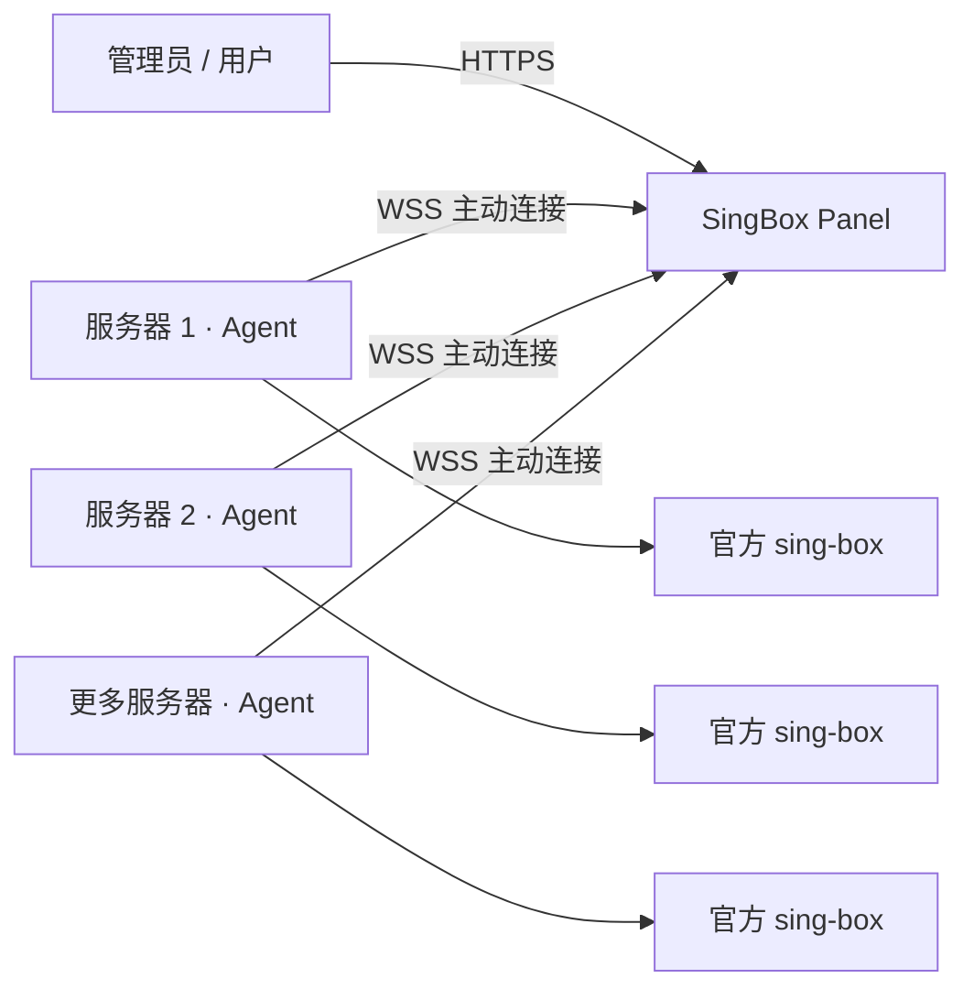

<div align="center">

# SingBox Panel

**通过 Agent 集中管理多台服务器上的 sing-box**

</div>

## 安装

准备一个已解析到面板服务器的域名，并为域名配置 HTTPS 反向代理。后期更换域名只需在命令后面加上 “-s -- --configure”

```bash
curl -fsSL https://raw.githubusercontent.com/hann0w0/SingBox-Panel/refs/heads/main/install.sh | sudo bash
```

脚本提供两种部署方式，首次安装时可选择：

| 方式 | 运行形态 | 数据位置 | 适用场景 |
| --- | --- | --- | --- |
| **Docker**（默认，推荐） | 容器 | `singbox-panel_data` 卷 | 常规部署 |
| **Binary** | 原生二进制 + systemd | `/opt/singbox-panel` | 无法安装 Docker 的环境，需要 systemd |

两种方式都只监听 `127.0.0.1`，必须通过 HTTPS 反向代理访问，面板不直接暴露公网。

生产环境会拒绝非 HTTPS 的 `base_url`，Agent 也只建立 WSS 控制连接。仅本机开发时，才可设置
`SINGBOX_PANEL_ENV=development` 使用 HTTP/WS；`--insecure` 同样只在该开发模式有效。

直接指定方式（跳过交互）：

```bash
curl -fsSL https://raw.githubusercontent.com/hann0w0/SingBox-Panel/refs/heads/main/install.sh | sudo bash -s -- --mode binary --base-url panel.example.com
```

常用参数可用 `-s -- --help` 查看，包括 `--port`、`--admin`、`--password`、`--install-dir`、`--version`、`--non-interactive`。

### 更新

再次执行安装命令即可更新。脚本会自动识别已有的部署方式，沿用现有域名、端口、管理员凭据和 `jwt_secret`，只替换程序本体。

```bash
curl -fsSL https://raw.githubusercontent.com/hann0w0/SingBox-Panel/refs/heads/main/install.sh | sudo bash
```

Binary 方式安装的产物会强制校验 Release 中的 `checksums.txt`，校验失败即中止安装。

### 卸载

卸载面板并保留配置和数据库：

```bash
curl -fsSL https://raw.githubusercontent.com/hann0w0/SingBox-Panel/refs/heads/main/install.sh | sudo bash -s -- --uninstall --yes
```

彻底卸载并删除数据库（不可恢复）：

```bash
curl -fsSL https://raw.githubusercontent.com/hann0w0/SingBox-Panel/refs/heads/main/install.sh | sudo bash -s -- --uninstall --purge --yes
```

卸载会自动识别当前的部署方式，无需手动指定。

## 工作方式



1. 面板部署在中心服务器上，通过 HTTPS 域名提供管理、订阅和 Agent 通信入口。
2. 在节点详情页复制安装命令，将 Agent 安装到被控服务器。
3. Agent 主动通过 WSS 连接面板，因此被控服务器不需要额外开放 Agent 管理端口。
4. 管理员在面板中维护节点、协议、出站和路由；配置下发前由 Agent 调用官方 `sing-box check` 校验。
5. 校验通过后 Agent 才更新配置并管理 sing-box 服务；校验失败时保留原配置，避免错误配置中断服务。
6. Agent 仅接受预设的管理指令，不提供任意 Shell 命令执行能力；安装和升级 sing-box 时使用官方发布版本。

面板支持两种配置方式：

- **面板管理**：由面板根据协议、出站和路由规则生成完整的 `config.json`。
- **原始配置**：保存管理员编辑或导入的完整 JSON，面板无法识别的字段也会原样保留。
