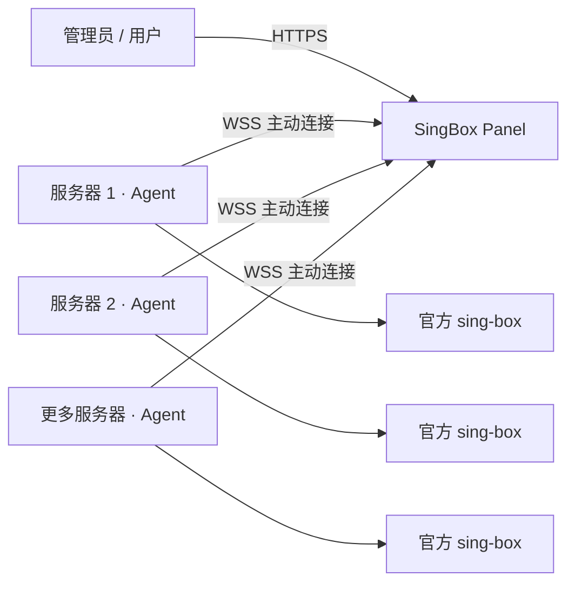

<div align="center">

# SingBox Panel

**通过 Agent 集中管理多台服务器上的 sing-box**

</div>

## 安装

准备一个已解析到面板服务器的域名，并为域名配置 HTTPS 反向代理。后期更换域名只需在命令后面加上 “-s -- --configure”

```bash
curl -fsSL https://raw.githubusercontent.com/hann0w0/SingBox-Panel/refs/heads/main/install.sh | sudo bash
```

### 更新

再次执行安装命令即可更新，脚本会沿用现有配置并拉取最新镜像。

```bash
curl -fsSL https://raw.githubusercontent.com/hann0w0/SingBox-Panel/refs/heads/main/install.sh | sudo bash
```

### 卸载

卸载面板并保留配置和数据库：

```bash
curl -fsSL https://raw.githubusercontent.com/hann0w0/SingBox-Panel/refs/heads/main/install.sh | sudo bash -s -- --uninstall --yes
```

彻底卸载并删除数据库（不可恢复）：

```bash
curl -fsSL https://raw.githubusercontent.com/hann0w0/SingBox-Panel/refs/heads/main/install.sh | sudo bash -s -- --uninstall --purge --yes
```

## 工作方式



1. 面板部署在中心服务器上，通过 HTTPS 域名提供管理、订阅和 Agent 通信入口。
2. 在节点详情页复制安装命令，将 Agent 安装到被控服务器。
3. Agent 主动通过 WSS 连接面板，因此被控服务器不需要额外开放 Agent 管理端口。
4. 管理员在面板中维护节点、协议、出站和路由；配置下发前由 Agent 调用官方 `sing-box check` 校验。
5. 校验通过后 Agent 才更新配置并管理 sing-box 服务；校验失败时保留原配置，避免错误配置中断服务。
6. Agent 仅接受预设的管理指令，不提供任意 Shell 命令执行能力；安装和升级 sing-box 时使用官方发布版本。

面板支持两种配置方式：

- **面板管理**：由面板根据协议、出站和路由规则生成完整的 `config.json`。
- **原始配置**：保存管理员编辑或导入的完整 JSON，面板无法识别的字段也会原样保留。
